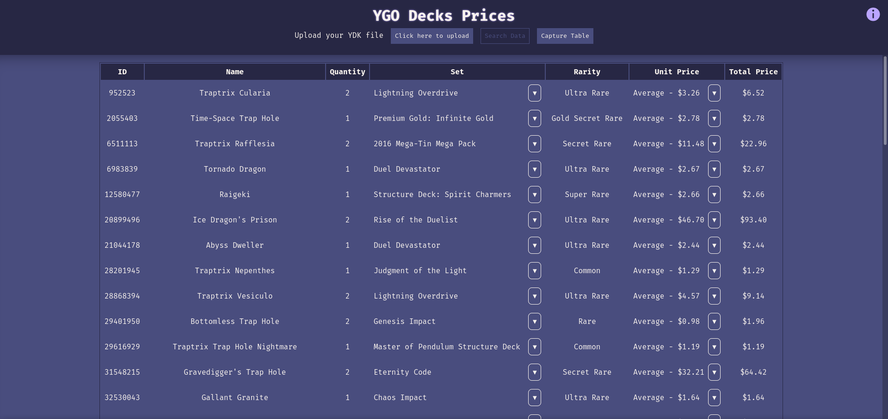

# YuGiOh Decks Prices
> English not my first language

Remake of [YuGiOh Cards Prices](https://github.com/JGQH/Yugioh-Cards-Prices)

## Table of contents
- [Introduction](#introduction)
- [Technologies](#technologies)
- [Illustrations](#illustrations)
- [To-Do](#to-do)

## Introduction
This project aims to remake my own Python project and turn it into a website, using a TypeScript Node back-end hosted in [Vercel](https://vercel.com/).

Back-End connects to other APIs for pricing individual cards, as well as a MongoDB Database (Due to API rate limits and just being careful when using external APIs)
## Technologies
-NodeJS v16.4.2

## Illustrations

## To-Do
- *About* section
- Refactor showing errors due to invalid card IDs
- Ydk tester (Since this project is in [portfolio](https://jgqh.github.io), it needs a test without a file)